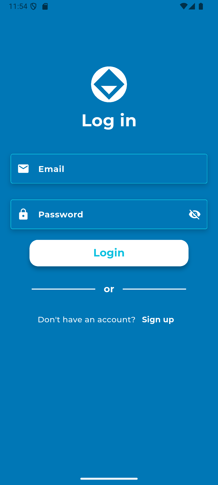
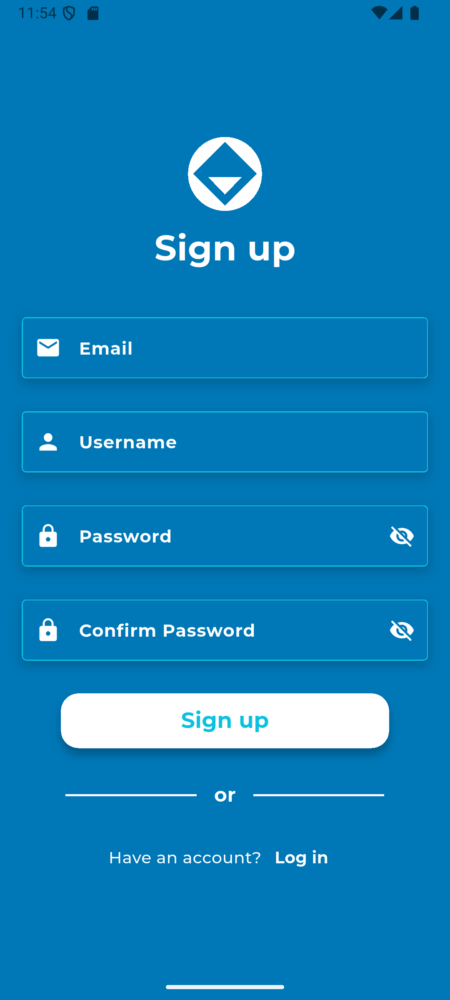
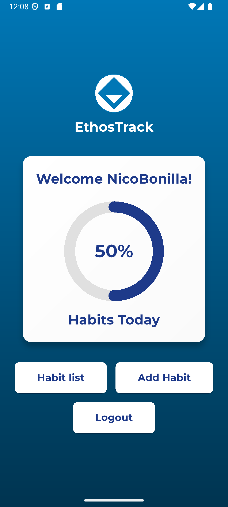
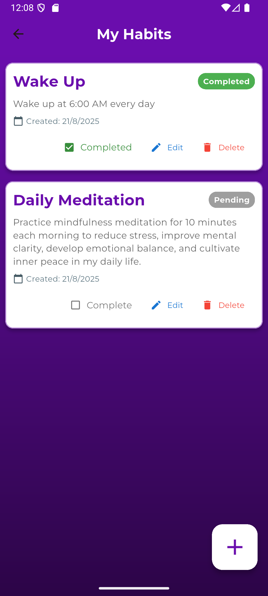
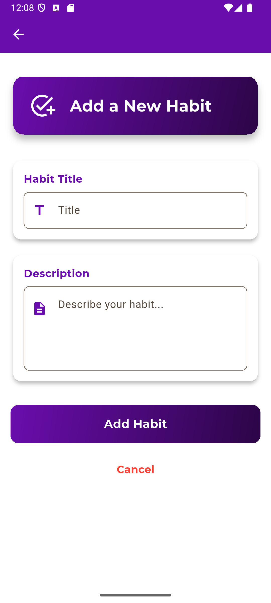
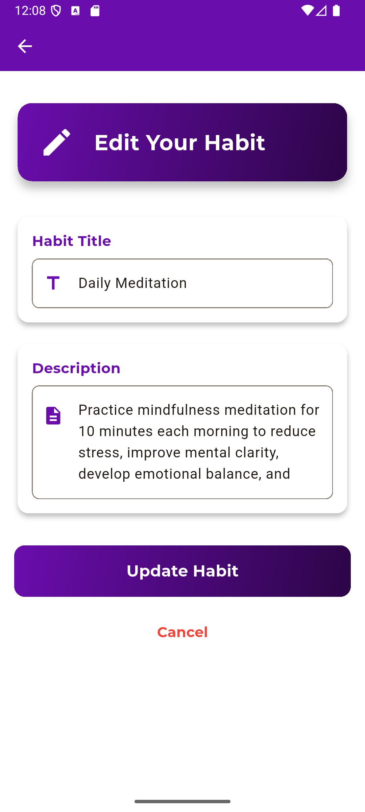

# 🏆EthosTrack - Habit Tracking App

**EthosTrack** is a **simple** and **fast** mobile app for **daily habit tracking.**

Users can **create**, **edit**, and **delete habits** shown in cards, with a **daily progress chart** to stay motivated.

Designed for anyone wanting a **practical** and **clear tool**, EthosTrack focuses on **ease of use** by avoiding unnecessary features.


## ✨ Features

### 🔐 **Authentication**
- User registration with email/password
- Secure login system
- Automatic session management
- User profile with username display

### 📝 **Habit Management**
- ✅ **Create** new habits with title and description
- 📖 **View** all habits in an organized list
- ✏️ **Edit** existing habits
- 🗑️ **Delete** habits you no longer need
- ☑️ **Toggle** completion status

### 📊 **Progress Tracking**
- Circular progress indicator
- Real-time completion percentage
- Animated progress updates

### 🎨 **Modern UI/UX**
- Gradient backgrounds
- Material Design cards
- Custom Google Fonts (Montserrat)

## 📱 Screenshots

<div align="center">


### 🔒Login


### 🔒Register


### 🏡 Home Screen with Progress


### 📃 Habit Management


### ➕ Create New Habits


### ✏️ Edit Habit

</div>


## 🚀 Getting Started

### Prerequisites

- **Flutter SDK** (3.8.1 or higher)
- **Dart SDK** (included with Flutter)
- **Android Studio** or **VS Code**
- **Firebase Account**

### Installation

1. **Clone the repository**
   ```bash
   git clone https://github.com/NicoBoni55/EthosTrack.git
   cd ethostrack
   ```

2. **Install dependencies**
   ```bash
   flutter pub get
   ```

3. **Configure Firebase**
   - Create a new Firebase project at [Firebase Console](https://console.firebase.google.com/)
   - Add Android/iOS apps to your project
   - Download and place the configuration files:
     - `android/app/google-services.json` (Android)
     - `ios/Runner/GoogleService-Info.plist` (iOS)

4. **Enable Firebase services**
   - **Authentication**: Enable Email/Password provider
   - **Firestore Database**: Create database in test mode
   - **Storage**: Enable for future file uploads

5. **Run the app**
   ```bash
   flutter run
   ```

## 🛠️ Dependencies

```yaml
dependencies:
  flutter: sdk: flutter
  cupertino_icons: ^1.0.8
  firebase_core: ^4.0.0           # Firebase core functionality
  firebase_auth: ^6.0.1           # User authentication
  cloud_firestore: ^6.0.0         # NoSQL database
  firebase_storage: ^13.0.0       # File storage
  flutter_svg: ^2.2.0             # SVG support for logo
  google_fonts: ^6.3.0            # Beautiful typography
  percent_indicator: ^4.2.5       # Progress indicators
```

## 📁 Project Structure

```
lib/
├── models/
│   ├── user_model.dart          # User data model
│   └── habit_model.dart         # Habit data model
├── screens/
│   ├── login.dart               # Login screen
│   ├── register.dart            # Registration screen
│   ├── home_screen.dart         # Dashboard with progress
│   └── habits/
│       ├── habits_list.dart     # List all habits
│       ├── create_habits_screen.dart  # Create new habits
│       └── edit_habits_screen.dart    # Edit existing habits
├── services/
│   ├── auth_service.dart        # Authentication logic
│   └── habit_service.dart       # Habit CRUD operations
└── main.dart                    # App entry point
```

## 🔥 Firebase Configuration

### Firestore Collections

#### Users Collection
```javascript
users: {
  userId: {
    username: string,
    email: string,
    createdAt: timestamp
  }
}
```

#### Habits Collection
```javascript
habits: {
  habitId: {
    userId: string,
    title: string,
    description: string,
    isCompleted: boolean,
    createdAt: timestamp
  }
}
```

### Security Rules

```javascript
// Firestore Security Rules
rules_version = '2';
service cloud.firestore {
  match /databases/{database}/documents {
    // Users can only access their own data
    match /users/{userId} {
      allow read, write: if request.auth != null && request.auth.uid == userId;
    }
    
    // Users can only access their own habits
    match /habits/{habitId} {
      allow read, write: if request.auth != null && 
        request.auth.uid == resource.data.userId;
      allow create: if request.auth != null && 
        request.auth.uid == request.resource.data.userId;
    }
  }
}
```

## 🎨 Design System

### Color Palette
- **Primary Gradient**: `#0077B6` → `#003450`
- **Text Color**: `#1E3A8A` (Navy Blue)
- **Success**: `#10B981` (Green)
- **Warning**: `#F59E0B` (Orange)
- **Error**: `#EF4444` (Red)
- **Background**: `#FFFFFF` (White)

### Typography
- **Font Family**: Montserrat (Google Fonts)
- **Weights**: Regular (400), Medium (500), Bold (700)

## 📊 Features Breakdown

### ✅ CRUD Operations
- **C**reate: Add new habits with validation
- **R**ead: Display habits in organized list
- **U**pdate: Edit habit details seamlessly
- **D**elete: Remove habits with confirmation

### 📈 Progress Tracking
- Real-time percentage calculation
- Visual progress indicators
- Animated state changes

### 🔐 Security
- Firebase Authentication
- Secure user sessions

## 👨‍💻 Author

**Nicolas Bonilla**
- GitHub: [@NicoBoni55](https://github.com/NicoBoni55)
- Email: nicobonilla0330@gmail.com